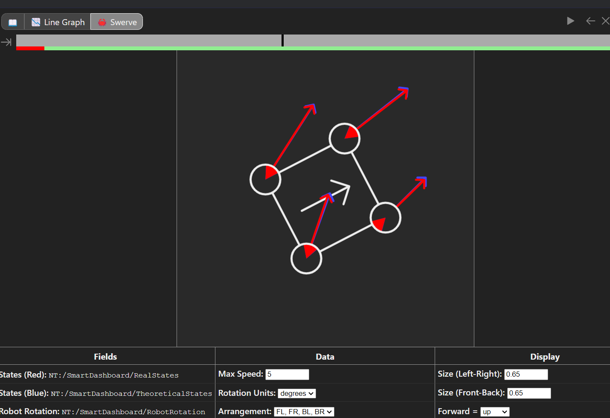

# 👽Team Optix 3749 Swerve Simulation👽

# What is this?
This is designed to be used with AdvantageScope, WPI Shuffleboard, and Visual Studio Code and simulates a four module swerve drive.

## In AdvantageScope

The red arrow is a real state (It's current movement) 
The blue arrow is the theoretical state(It's desired movement) 

 Set the red state to `NT:/SmartDashboard/RealStates`
 Set the blue state to `NT:/SmartDashboard/TheoreticalStates`
 Set the Robot Rotation to `NT:/SmartDashboard/RobotRotation`
 Set the max speed to 5, and the rotation units to degrees
